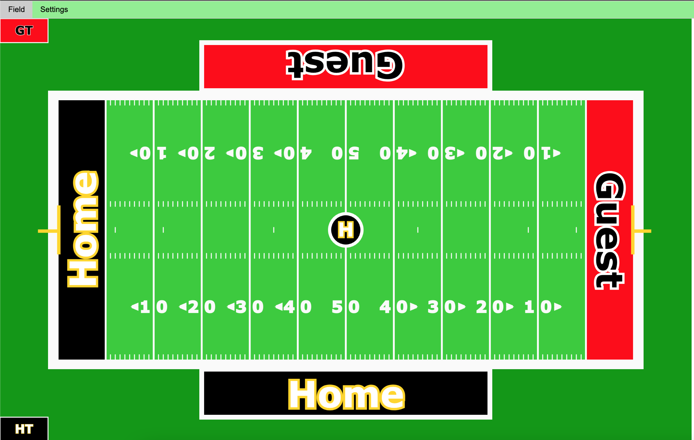
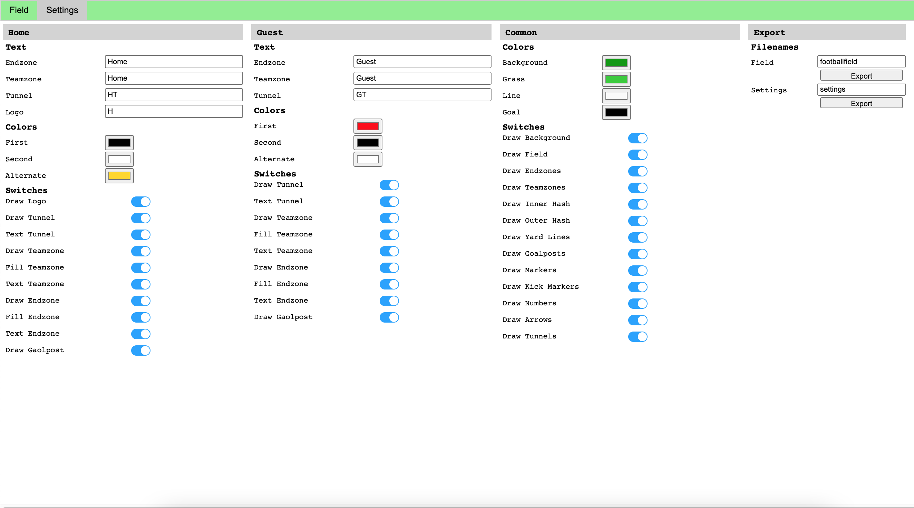

# Football Field Composer

A simple Football Field Composer with hopefully no copyright problems for composing a background image with a football field for another project of arjs.


## License

[MIT](https://choosealicense.com/licenses/mit/)

  
## Acknowledgements

 - [p5.js by Processing Foundation](https://p5js.org/)
 - [Tabs, Modalbox by w3schools.com](https://www.w3schools.com/)
 - [Fontawsome Free by fontawsome.com](https://fontawesome.com/)
 - [Checkbox by evanliu2968](https://github.com/EvanLiu2968/el-checkbox/)


  
## Tech Stack

**Client:** HTML5, CSS, p5.js, Javascript

**Server:** Just a webserver

  
## Screenshots




  
## Demo

Insert gif or link to demo

  
## Run Locally

Clone the project

```bash
  git clone https://github.com/arjs-public/2021.05.001.git
```

Go to the project directory

```bash
  cd 2021.05.001
```

Run vscode

```bash
  vscode .
```

Install 'Go Live' vscode plugin

```vscode
  - Go to plugins
  - Search "Go Live"
  - Install "Go Live"-plugin
```

Start the server

```vscode
  Press "Go Live" button on lower right corner
```

  
## Deployment

To deploy this project put the code to your favorite web server, like nginx, apache, teseve, ...

  
## Feedback

If you have any feedback, please reach out at https://github.com/arjs-public

  
## Roadmap

- Bug fixes
- Maybe loadable settings
- Maybe logo bitmaps

  
## Authors

- [alexrjs](https://github.com/arjs-public)

  