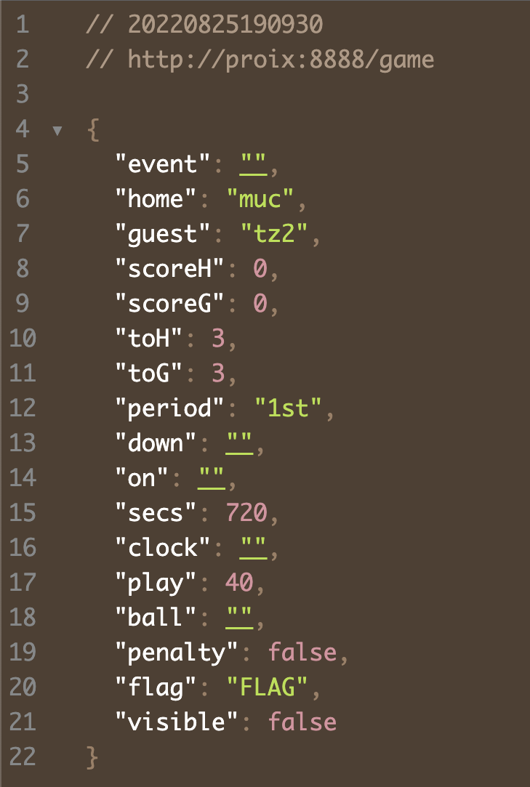
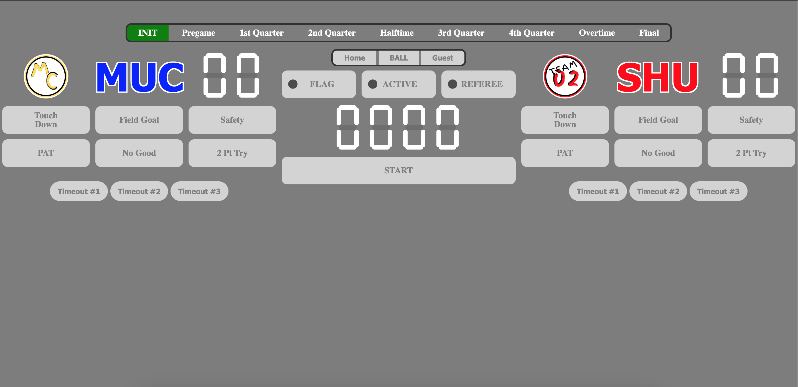
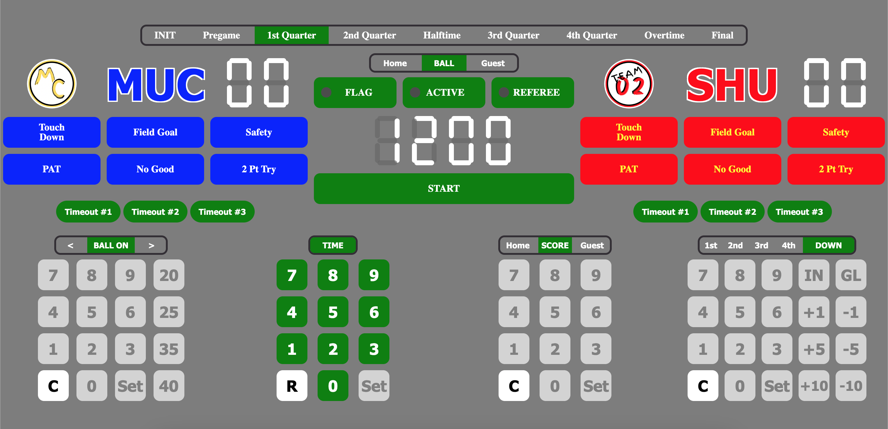
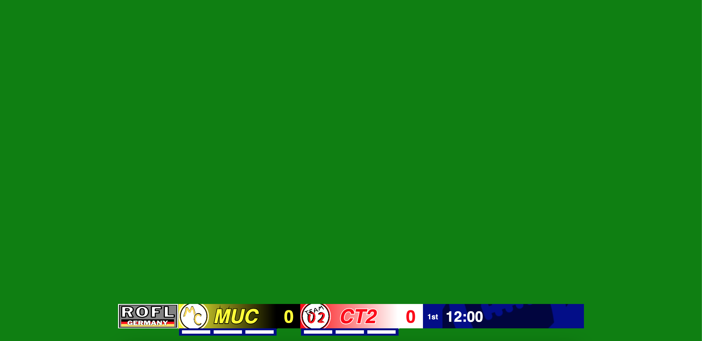

# Football Overlay Scoreboard

A simple Football Overlay Scoreboard with hopefully no copyright problems for composing a scoreboard and some overlays for live streams.


## License

[MIT](https://choosealicense.com/licenses/mit/)

  
## Acknowledgements

 - [p5.js by Processing Foundation](https://p5js.org/)
 - [Github Ribbon by Daniel Perez Alvarez](https://www.unindented.org/blog/github-ribbon-using-css-transforms/)
 - [Typicode JSON Server](https://github.com/typicode/json-server)


  
## Tech Stack

**Client:** HTML5, CSS, p5.js, Javascript

**Server:** json-server

  
## Screenshots






  
## Demo

(Not done, yet) You can try it [here](https://arjs-public.github.io/arjs.projects.github.io/2023.01.001/index.html)

  
## Run Locally

Clone the project

```bash
  git clone https://github.com/arjs-public/2023.01.001.git/
```

Go to the project directory

```bash
  cd 2023.01.001
```

Run vscode

```bash
  vscode .
```

Start the server  
- Update the start.sh script for your setup.

```bash
  ./start.sh
```
  
## Deployment

To deploy this project put the code to your favorite node.js server, start the json-server and open the index.html in your favorite web browser ...

  
## Feedback

If you have any feedback, please reach out at https://github.com/arjs-public

  
## Roadmap

- Bug fixes
- Maybe loadable settings
- Maybe better overlays

  
## Authors

- [alexrjs](https://github.com/arjs-public)

